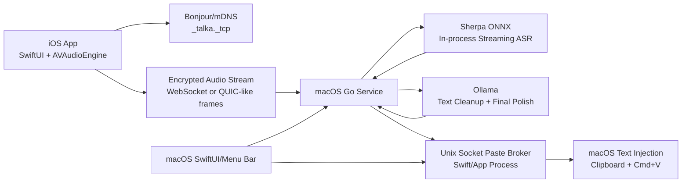

# Talka Technical Architecture

## Architecture Summary

Talka uses a split local architecture:

- iOS app: audio capture and user-facing microphone controls.
- macOS Go service: pairing, encrypted transport, audio session control, ASR orchestration, Ollama post-processing, and text insertion.
- macOS SwiftUI shell: menu bar UI, settings, diagnostics, native Accessibility state, and the local paste broker.
- Sherpa ONNX: in-process local streaming recognizer packaged with the macOS app bundle. The default model profile is the bilingual zh-en Paraformer bundle.
- Ollama: local LLM post-processing.



## Repository Layout

Planned layout:

```text
apps/
  ios/
    TalkaIOS/
  macos/
    TalkaMac/

cmd/
  talka-server/
  talka-asr-runtime/

internal/
  app/
  asr/
  audio/
  config/
  crypto/
  inject/
  llm/
  mdns/
  pairing/
  protocol/
  session/

docs/
  product-design.md
  technical-architecture.md
  development-plan.md

models/
  funasr/
```

`cmd/talka-asr-runtime` remains useful as a compatibility entrypoint and packaging target, but the packaged macOS app should boot the embedded FunASR runtime by default instead of requiring Docker or a separately managed runtime.

## iOS App

Technology:

- SwiftUI for UI.
- AVAudioEngine for microphone capture.
- Network framework for local network connections.
- Bonjour/mDNS discovery.
- Keychain for paired-device credentials.

Audio format:

- Sample rate: 16 kHz.
- Channels: mono.
- Encoding: PCM signed 16-bit little endian.
- Frame size: 20 ms or 40 ms for transport.
- Optional future codec: Opus.

Local permissions:

- Microphone permission.
- Local network permission.
- Bonjour service declaration in Info.plist.

The app should avoid starting local network discovery before the user chooses to connect, because iOS local network permission prompts are more understandable when tied to a visible user action.

## macOS App And Service

The macOS side has three cooperating layers:

1. SwiftUI app shell.
2. Go service core.
3. Embedded ASR runtime and model assets bundled in the app resources.

The SwiftUI layer owns:

- Menu bar item.
- Settings windows.
- Integrated status and PIN display.
- Accessibility permission guidance.
- Device management UI.
- Diagnostics UI.
- Native Accessibility permission checks with `AXIsProcessTrusted()`.
- Local Unix domain socket paste broker for posting Cmd+V from the app process.

The Go service owns:

- TCP/WebSocket listener.
- Bonjour advertisement.
- Pairing state.
- Encrypted session state.
- Audio stream session state.
- ASR runtime management across embedded, external, and legacy compatibility modes.
- Ollama API calls.
- Text insertion orchestration.
- Structured logs.

Go should expose a small localhost control API for the SwiftUI shell:

```text
GET  /v1/status
GET  /v1/devices
POST /v1/pairing/start
POST /v1/devices/{id}/forget
GET  /v1/config
PUT  /v1/config
POST /v1/permissions/accessibility/open
```

The tray menu is intentionally minimal:

```text
Settings
Quit
```

The tray icon's green dot is computed in the SwiftUI shell and requires all of the following:

- Service ready.
- AI API healthy.
- ASR API healthy.
- Native Accessibility permission granted.

The app must not rely only on `GET /v1/status` for Accessibility state, because the Go service may report `unknown` while the Swift app process can query the authoritative macOS TCC state.

## Discovery

Use Bonjour/mDNS with a service type such as:

```text
_talka._tcp
```

Advertised TXT records:

```text
version=1
device_name=<mac name>
protocol=talka-stream-v1
pairing=required|paired
```

The TXT record must not include secrets.

## Pairing And Encryption

The system should not invent a custom cipher. It should use standard cryptographic primitives with a simple Talka-specific handshake.

Recommended primitives:

- X25519 for ephemeral key exchange.
- HKDF-SHA256 for key derivation.
- HMAC-SHA256 for PIN-authenticated transcript verification.
- ChaCha20-Poly1305 for message encryption.
- Secure random session IDs and nonces.

First pairing flow:

1. iOS connects to the discovered macOS service.
2. macOS creates a six-digit PIN and shows it in the UI.
3. iOS submits a pairing request with its ephemeral public key and device metadata.
4. macOS responds with its ephemeral public key.
5. Both sides compute ECDH shared secret.
6. Both sides derive a PIN-authenticated confirmation value from the handshake transcript.
7. The connection is accepted only if confirmation values match.
8. Both sides store long-term device identity keys in Keychain.

Session encryption:

```text
message = {
  version: 1,
  session_id: bytes,
  seq: uint64,
  type: enum,
  ciphertext: bytes,
  tag: bytes
}
```

Rules:

- `seq` must be strictly increasing per direction.
- Each message type is included as associated data.
- Sessions expire after inactivity.
- Pairing attempts are rate limited.

## Transport Protocol

Use WebSocket for MVP. It is simple to inspect, works well with iOS and Go, and maps cleanly to binary audio frames.

Transport message types:

```text
client_hello
server_hello
pairing_confirm
session_resume
audio_start
audio_frame
audio_stop
audio_cancel
asr_partial
asr_final
text_final
error
ping
```

Audio session metadata:

```json
{
  "sample_rate": 16000,
  "channels": 1,
  "encoding": "pcm_s16le",
  "frame_duration_ms": 20,
  "language": "zh-CN"
}
```

## ASR Runtime

ASR uses FunASR C++/ONNX Runtime directly, but the packaged product should default to an embedded runtime instead of requiring Docker or a separately launched process.

Default packaged process model:

```text
TalkaMac.app
  Contents/MacOS/TalkaMac
  Contents/Resources/talka-server
  Contents/Resources/talka-asr-runtime
  Contents/Resources/models/funasr/...
  Contents/Frameworks/*.dylib
```

Internal provider modes:

```text
funasr   bundled FunASR runtime + bundled models, streaming through Talka sidecar protocol
onnx     in-process sherpa-onnx streaming recognizer
```

User-facing ASR mode:

```text
FunASR   maps to funasr
ONNX     maps to onnx
```

The settings UI intentionally exposes only `FunASR` and `ONNX`. FunASR's internal recognition mode, such as `2pass`, remains a runtime configuration detail and should not be presented as the product-level ASR mode.

In FunASR mode, the Go service starts, monitors, and restarts the bundled runtime, then streams iOS audio frames into it as they arrive. In ONNX mode, the Go service streams frames into sherpa-onnx directly in process.

Benefits:

- Keeps Go service independent from C++ runtime crashes.
- Avoids complex cgo linkage in the first version.
- Makes the ASR backend replaceable without changing the iOS client flow.
- Allows direct packaged distribution without Docker in the default path.
- Preserves a migration path for external runtimes and legacy deployments.

Required ASR model set:

```text
models/funasr/
  paraformer-zh-onnx/
  paraformer-zh-online-onnx/
  fsmn-vad-onnx/
  ct-punc-onnx/
  itn-zh/
```

The existing Python prototype in `/Users/darluc/Codes/asr-test` uses FunASR `AutoModel` with PyTorch `.pt` models. For the production path, use ONNX models directly rather than the Python environment.

ASR modes:

- MVP: 2-pass or phrase-level realtime recognition.
- Later: lower-latency streaming partial recognition.

MVP ASR behavior:

1. Go receives encrypted PCM frames from iOS.
2. Go forwards frames to the selected ASR runtime.
3. ASR runtime returns partial text for display.
4. ASR runtime returns final segment text after VAD endpointing.
5. Go accumulates final segments.
6. Recording stop triggers final text assembly and Ollama cleanup.

## LLM Post-Processing

Ollama remains the default local LLM provider.

Default config:

```yaml
llm:
  provider: ollama
  base_url: http://localhost:11434
  model: qwen3:8b
  timeout_seconds: 30
```

Two LLM processing levels:

1. Segment cleanup: punctuation, simple dedupe, spacing normalization.
2. Final cleanup: merge all segments into final text while preserving meaning.

The final cleanup prompt must be strict:

- Do not add facts.
- Do not change meaning.
- Do not summarize unless asked.
- Keep the user's original tone.
- Output only the final text.

## Text Injection

Primary mode:

- Clipboard paste with a Swift-owned Accessibility-driven Cmd+V.

Required macOS permission:

- Accessibility permission for the Talka macOS app.

Processes:

```text
TalkaMac.app
  SwiftUI app process
  LocalPasteBroker       /tmp/talka-paste-<pid>.sock
  talka-server           TALKA_PASTE_BROKER_SOCKET=/tmp/talka-paste-<pid>.sock
```

Broker protocol:

```json
{"op":"preflight"}
{"op":"paste"}
```

Broker responses:

```json
{"ok":true}
{"ok":false,"error":"accessibility_missing"}
{"ok":false,"error":"bad_request"}
```

Clipboard insertion steps:

1. Go asks the Swift paste broker to run `preflight`.
2. The broker checks `AXIsProcessTrusted()` in the app process.
3. If Accessibility is missing, Go returns `accessibility_missing` and does not write the clipboard.
4. Go reads the current clipboard.
5. Go writes final text.
6. Go asks the broker to run `paste`.
7. The broker posts Cmd+V with CoreGraphics.
8. Go restores prior clipboard after a short delay if unchanged by the user.

Failure handling:

- If Accessibility permission is missing, show settings guidance and avoid clipboard mutation.
- If paste fails, keep final text in Talka's transcript history and show a copy button.
- If clipboard restore fails, log a warning and surface it in diagnostics.

The broker is a Unix domain socket instead of HTTP. It is local to the app process, uses a per-process path under `/tmp`, is chmodded user-only, and avoids exposing a general-purpose local HTTP paste endpoint.

Important macOS TCC behavior:

- TCC Accessibility trust is tied to the running app's signing identity and bundle identity.
- Ad-hoc signed builds have no stable TeamIdentifier and can change code hash after repackaging.
- If Settings shows the app as authorized but `AXIsProcessTrusted()` returns false, the likely recovery is removing the old Accessibility entry and granting permission to the currently installed app.
- Long term, release builds should use stable signing to reduce TCC churn.

## Configuration

Suggested config file:

```text
~/Library/Application Support/Talka/config.yaml
```

Example:

```yaml
server:
  bind_host: 0.0.0.0
  port: 0
  service_name: Talka

asr:
  provider: funasr
  runtime_path: /Applications/Talka.app/Contents/Resources/talka-asr-runtime
  host: 127.0.0.1
  port: 10095
  mode: 2pass
  sample_rate: 16000
  models:
    asr: models/funasr/paraformer-zh-onnx
    online: models/funasr/paraformer-zh-online-onnx
    vad: models/funasr/fsmn-vad-onnx
    punc: models/funasr/ct-punc-onnx
    itn: models/funasr/itn-zh

llm:
  provider: ollama
  base_url: http://localhost:11434
  model: qwen3:8b
  timeout_seconds: 30

injection:
  mode: clipboard_paste
  restore_clipboard: true

logging:
  level: info
  capture_audio: false
  capture_transcript: false
```

Example ONNX runtime override:

```yaml
asr:
  provider: onnx
  mode: streaming
  sample_rate: 16000
```

Settings mapping:

- `llm.base_url` maps to AI Endpoint.
- `llm.model` maps to AI Model.
- `llm.timeout_seconds` maps to AI Timeout.
- `asr.provider` maps to ASR Mode.
- `asr.mode` remains an internal runtime value such as `2pass`.

Secrets and paired-device keys should live in Keychain, not in this YAML file.

## Error Handling

Important error classes:

- iOS microphone permission denied.
- iOS local network permission denied.
- Mac service not discoverable.
- PIN expired or incorrect.
- Encrypted session rejected.
- ASR runtime unavailable.
- ASR model missing or incompatible.
- Ollama unavailable.
- Accessibility permission missing.
- Active app rejected paste.
- TCC entry points at an old ad-hoc-signed app identity.

Each error should include:

- User-facing short message.
- Developer diagnostic code.
- Recovery action.

## Observability

Log structured events:

- Pairing started, succeeded, failed.
- Device connected, disconnected.
- Audio session started, stopped, canceled.
- ASR runtime health changes.
- ASR segment latency.
- Ollama request latency.
- Text insertion success or failure.
- Paste broker preflight failure.

Do not log raw audio or full transcript unless diagnostic capture is explicitly enabled by the user.

## Security Boundaries

- The local network is untrusted.
- Bonjour discovery is not authentication.
- PIN pairing authenticates first contact.
- Keychain stores trusted device identity.
- Embedded ASR runtime listens only on localhost or Unix socket.
- Paste broker uses a per-process Unix domain socket and accepts only `preflight` and `paste`.
- The packaged macOS app must not require Docker in the default path.
- Ollama is called only at the configured local URL by default.
- No cloud endpoint should be introduced without explicit configuration.

## External Technical References

- FunASR runtime: https://github.com/modelscope/FunASR/tree/main/runtime
- ONNX Runtime macOS build guidance: https://onnxruntime.ai/docs/build/inferencing.html
- Ollama API documentation: https://docs.ollama.com/api
- Apple local network privacy guidance: https://developer.apple.com/videos/play/wwdc2020/10110/
